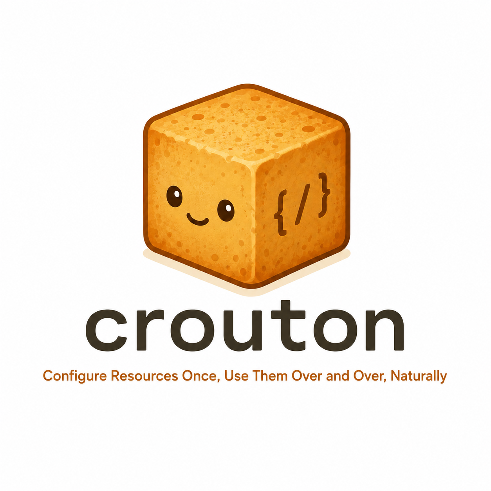

<div align="center">
  

<h3>wrap your CRUD in one neat package.</h3>

  <p><em><strong>C</strong>onfigure <strong>R</strong>esources <strong>O</strong>nce, <strong>U</strong>se <strong>T</strong>hem <strong>O</strong>ver and Over, <strong>N</strong>aturally</em></p>
</div>

---

A schema-driven CRUD framework for **NestJS + Vue**. Define your resources once in JSON — crouton handles the rest: API
endpoints, data tables, forms, and filters.

Configure resources once. Use them over and over. No boilerplate, just filling.

## Packages

| Package                 | Description                                                                                           |
|-------------------------|-------------------------------------------------------------------------------------------------------|
| `@ghentcdh/crouton-api` | NestJS library — generates controllers, repositories, and `/schemas` endpoints from a `resource.json` |
| `@ghentcdh/crouton-vue` | Vue 3 component library — renders data tables, forms, filters, and views driven by the schemas        |

## How it works

1. **Define** your resource in a `resource.json` file — columns, operations, filters, relations
2. **Register** it with crouton-api — fully typed NestJS routes appear automatically
3. **Connect** the Vue components — tables, forms, and filters render from the schema with no extra config

```json
{
  "name": "author",
  "route": "authors",
  "model": "author",
  "operations": {
    "findAll": true,
    "findOne": true,
    "create": true,
    "update": true
  },
  "columns": {
    "id": {
      "hiddenInForm": true,
      "idField": true
    },
    "name": {
      "searchable": true,
      "filterable": true
    },
    "bio": {
      "fieldInput": {
        "type": "textarea"
      }
    }
  }
}
```

That's it. You get a paginated list endpoint, a detail endpoint, create/update with Zod validation, a `/schemas`response
the Vue components consume, and a full admin UI — all from that one file.

## Installation

```sh
# API (NestJS)
pnpm add @ghentcdh/crouton-api

# Vue
pnpm add @ghentcdh/crouton-vue
```

## Development

This is an [Nx](https://nx.dev) monorepo with pnpm workspaces.

```sh
# Install dependencies
pnpm install

# Build all packages
npx nx run-many -t build

# Typecheck
npx nx run-many -t typecheck
```

### Packages

```
packages/
  crouton-api/   — NestJS CRUD framework
  crouton-vue/   — Vue 3 UI components
```

> `crouton-core` is an internal build-time package bundled into both `crouton-api` and `crouton-vue` — it is never
> published separately.

---


---

## License

This project is licensed under the **MIT License**. See the [LICENSE](./LICENSE) file for details.

## Credits

Bo Vandersteene, Ghent University.

Development by [Ghent Centre for Digital Humanities - Ghent University](https://www.ghentcdh.ugent.be/). Funded by
the [GhentCDH research projects](https://www.ghentcdh.ugent.be/projects).


