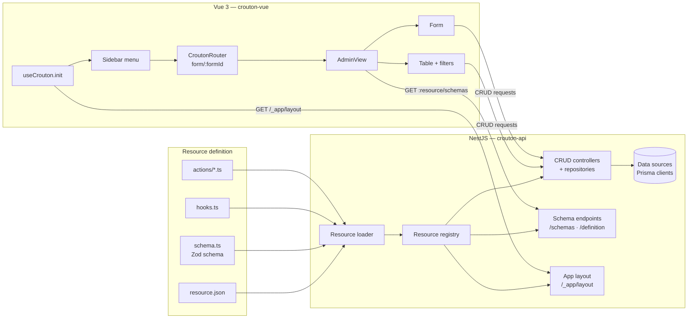

# Using crouton

Crouton is a schema-driven CRUD framework for **NestJS + Vue**. You define each resource once — in a `resource.json` file plus a Zod schema — and crouton generates the API endpoints, validation, data tables, forms, and filters for it.

::: warning Work in progress
Crouton is still in active development. APIs, schemas, and components may change without notice.
:::

## How it works

A crouton backend is a folder of resource definitions next to a folder of data sources:

```
src/app/
├── resources/
│   └── book/
│       ├── resource.json        # declarative config (operations, columns, actions)
│       ├── resource.author.json # sub-resource (relation) — optional
│       ├── schema.ts            # Zod schema (default export)
│       ├── hooks.ts             # lifecycle hooks — optional
│       └── actions/
│           └── publish.ts       # procedure implementations — optional
└── data-sources/
    └── maindb/
        ├── data-source.json     # { "name": "maindb", "type": "prisma", "default": true }
        └── index.ts             # default export: PrismaClient
```

At startup, `crouton-api` loads these definitions, registers CRUD controllers and repositories per resource, and exposes schema endpoints. The Vue frontend bootstraps once, fetches the layout for its sidebar, and renders tables and forms straight from those schemas.



## In this guide

- [Getting started](./getting-started.md) — `npm create @ghentcdh/crouton` or `npx @ghentcdh/add-crouton` to set up a new or existing project
- [Manual setup](./manual-setup.md) — add crouton to an existing project step by step, without the CLI
- [CLI & project config](./cli.md) — `crouton.json`, `crouton create-datasource`, and `crouton update resources`
- [Backend setup](./backend.md) — register crouton in your NestJS application
- [Frontend setup](./frontend.md) — bootstrap crouton in your Vue application
- [resource.json](./resource-json.md) — the resource configuration reference
- [Data sources](./datasource.md) — connecting one or more databases
- [Actions](./actions.md) — custom row and table actions
- [Hooks](./hooks.md) — lifecycle hooks around reads and writes
- [Custom styling](./styling.md) — theming with Tailwind and daisyUI
