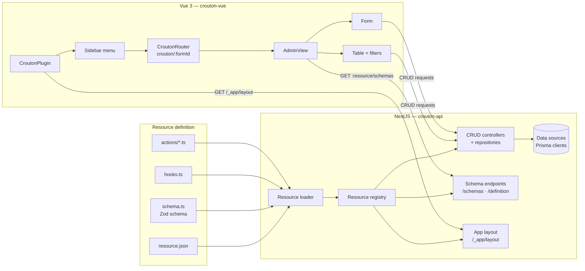

# Using crouton

Crouton is a schema-driven CRUD framework for **NestJS + Vue**. You define each resource once — in a `resource.json`
file plus a Zod schema — and crouton generates the API endpoints, validation, data tables, forms, and filters for it.

::: warning Work in progress Crouton is still in active development. APIs, schemas, and components may change without
notice.
:::

## How it works

A crouton backend is a folder of resource definitions next to a folder of data sources:

```
src/app/
├── resources/
│   ├── book/                    # prisma-backed resource
│   │   ├── resource.json        # declarative config (operations, columns, actions)
│   │   ├── resource.author.json # sub-resource (relation) — optional
│   │   ├── schema.ts            # Zod schema (default export)
│   │   ├── hooks.ts             # lifecycle hooks — optional
│   │   └── actions/
│   │       └── publish.ts       # procedure implementations — optional
│   └── zotero_item/             # custom resource — see guide/custom-resource.md
│       ├── resource.json        # "kind": "custom" — configures the UI only
│       └── repository.ts        # your findAll / findOne / create / …
└── data-sources/
    └── maindb/
        ├── data-source.json     # { "name": "maindb", "type": "prisma", "default": true }
        └── index.ts             # default export: PrismaClient
```

At startup, `crouton-api` loads these definitions, registers CRUD controllers and repositories per resource, and exposes
schema endpoints. The Vue frontend bootstraps once, fetches the layout for its sidebar, and renders tables and forms
straight from those schemas.


```mermaid
flowchart LR
    subgraph definition [Resource definition]
        RJ[resource.json]
        ZS[schema.ts<br/>Zod schema]
        HK[hooks.ts]
        AC[actions/*.ts]
    end

subgraph backend [NestJS — crouton-api]
LOADER[Resource loader]
REG[Resource registry]
CRUD[CRUD controllers<br/>+ repositories]
SCHEMAS[Schema endpoints<br/>/schemas · /definition]
LAYOUT[App layout<br/>/_app/layout]
DS[(Data sources<br/>Prisma clients)]
end

subgraph frontend [Vue 3 — crouton-vue]
INIT[CroutonPlugin]
SIDEBAR[Sidebar menu]
ROUTER[CroutonRouter<br/>crouton/:formId]
ADMIN[AdminView]
TABLE[Table + filters]
FORM[Form]
end

RJ --> LOADER
ZS --> LOADER
HK --> LOADER
AC --> LOADER
LOADER --> REG --> CRUD
REG --> SCHEMAS
REG --> LAYOUT
CRUD --> DS

INIT -->|GET /_app/layout|LAYOUT
INIT --> SIDEBAR --> ROUTER --> ADMIN
ADMIN -->|GET :resource/schemas|SCHEMAS
ADMIN --> TABLE
ADMIN --> FORM
TABLE -->|CRUD requests|CRUD
FORM -->|CRUD requests|CRUD
```

## In this guide

### Getting started
- [Getting started](1.getting-started/index.md) — `npm create @ghentcdh/crouton` or `npx @ghentcdh/add-crouton` to set up a new or existing project
- [Project structure](1.getting-started/project-structure.md) — what lives where after scaffolding
- [Manual setup](1.getting-started/manual-setup.md) — add crouton to an existing project step by step, without the CLI

### Resources
- [resource.json](2.resources/index.md) — the resource configuration reference
- [Columns](2.resources/columns.md) — column definitions, fieldInput, calculated columns
- [Relations](2.resources/relations.md) — relation columns and sorting
- [Operations](2.resources/operations.md) — CRUD operations and external operation URIs
- [Actions](2.resources/actions.md) — custom row and table actions
- [Hooks](2.resources/hooks.md) — lifecycle hooks around reads and writes

### Backend
- [Backend setup](3.backend/index.md) — register crouton in your NestJS application
- [Data sources](3.backend/data-sources.md) — connecting one or more databases, custom adapters
- [Status page](3.backend/status.md) — built-in health checks and diagnostics

### Frontend
- [Frontend setup](4.frontend/index.md) — bootstrap crouton in your Vue application
- [Custom renderers](4.frontend/custom-renderers.md) — custom Vue components for fields, cells, and full forms
- [Custom styling](4.frontend/styling.md) — theming with Tailwind and daisyUI
- [Translations](4.frontend/translations.md) — server-side i18n

### Tooling
- [CLI & project config](5.tooling/cli.md) — `crouton.json`, `crouton create-datasource`, and `crouton update resources`
- [Resource editor](5.tooling/resource-editor.md) — dev-mode visual builder and ResourceJsonEditor component

### Reference
- [crouton.json](reference/crouton-json.md) — all crouton.json keys in one place
- [HTTP endpoints](reference/endpoints.md) — all routes in one place
- [Packages](reference/packages.md) — what each package is and when to install it
- [parseSchema](reference/parse-schema.md) — offline schema compilation
